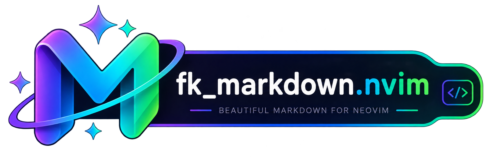

<div align="center">
  
  <p>
    <a href="https://github.com/the-mayankjha/fk_markdown.nvim/stargazers"></a>
    <a href="https://github.com/the-mayankjha/fk_markdown.nvim/blob/main/LICENSE"></a>
    
    
  </p>
</div>

A lightweight Neovim plugin for rendering and customizing Markdown elements with flexible Lua configuration. Provides beautiful, customizable rendering of headers, code blocks, tables, callouts, lists, and more.

## ✨ Features

- 🎨 **Fully customizable** — Configure every element with highlight groups, sizes, and styles
- ⚡ **Lightweight** — Minimal overhead with efficient rendering
- 🔧 **Per-element configuration** — Separate config docs for each Markdown element
- 📝 **Wide support** — Headers, emphasis, links, tables, code blocks, quotes, callouts, lists, and images
- 🎯 **Treesitter integration** — Enhanced syntax highlighting for code blocks

<div align="center" style="margin: 30px 0;">
  
</div>

---

## 📦 Installation

### Using [packer.nvim](https://github.com/wbthomason/packer.nvim)

```lua
use {
  'the-mayankjha/fk_markdown.nvim',
  config = function()
    require('fk_markdown').setup({
      -- configuration here (see examples below)
    })
  end
}
```

### Using [vim-plug](https://github.com/junegunn/vim-plug)

```vim
Plug 'the-mayankjha/fk_markdown.nvim'
```

Then in your `init.lua`:

```lua
require('fk_markdown').setup({
  -- configuration here
})
```

### Using [lazy.nvim](https://github.com/folke/lazy.nvim)

```lua
{
  'the-mayankjha/fk_markdown.nvim',
  config = function()
    require('fk_markdown').setup({
      -- configuration here
    })
  end
}
```

### Using [rocks.nvim](https://github.com/nvim-neorocks/rocks.nvim)

```bash
:Rocks install fk_markdown.nvim
```

---

## ⚙️ Quick Setup

Minimal configuration to get started:

```lua
require('fk_markdown').setup({})
```

For a more personalized setup, see the **Feature Configuration** section below.

---

## 🎨 Feature Configuration

### Headers

Render Markdown headers (#, ##, ###, etc.) with customizable icons, background colors, and font colors per heading level.

<div align="center">
  
  <p><em>Headers with custom icons and per-level foreground colors</em></p>
</div>

**Configuration:**

```lua
require('fk_markdown').setup({
    heading = {
        enabled = true,
        -- Set to false to show native '#' markers instead of icons
        icon = true,
        -- Custom icons for H1 to H6
        icons = { '󰲡 ', '󰲣 ', '󰲥 ', '󰲧 ', '󰲩 ', '󰲫 ' },
        background = {
            enabled = false,
            -- Background fill colors for H1 -> H6
            bg_color = {
                "#1e1e2e", "#1e1e2e", "#1e1e2e",
                "#1e1e2e", "#1e1e2e", "#1e1e2e",
            },
            -- Foreground text colors for H1 -> H6
            font_color = {
                "#f38ba8", "#fab387", "#f9e2af",
                "#a6e3a1", "#74c7ec", "#cba6f7",
            },
        },
    },
})
```

**Options:**
- `enabled` — Toggle heading rendering (`boolean`)
- `icon` — Show custom icons or native `#` markers (`boolean`)
- `icons` — List of icons for H1 to H6 (`string[]`)
- `background.enabled` — Toggle background fill behind headers (`boolean`)
- `background.bg_color` — Hex colors for backgrounds H1–H6 (`string[]`)
- `background.font_color` — Hex colors for foreground text H1–H6 (`string[]`)

[Full header configuration docs →](doc/configuration/header.md)

---

### Code Blocks

Render fenced code blocks with rounded borders, dynamic DevIcon-colored language pills, background fills, and granular padding.

<div align="center">
  
  <p><em>Code blocks with dynamic language-colored borders and title pills</em></p>
</div>

**Configuration:**

```lua
require('fk_markdown').setup({
    code = {
        enabled = true,
        -- 'wide' spans the full window width, 'compact' wraps the text tightly
        style = 'wide',
        background = {
            enabled = false,
            color = "#181825",
        },
        padding = {
            top = 1,     -- Virtual lines between top border and code
            bottom = 1,  -- Virtual lines between code and bottom border
            left = 1,    -- Spaces between left border │ and code
            right = 2,   -- Extra right-side width (useful for 'compact')
        },
        border = {
            enabled = true,
            -- "dynamic" matches the DevIcon color of the language
            -- "static" uses the hex color below for all blocks
            type = "dynamic",
            color = "#f38ba8",
        },
        title = {
            enabled = true,
            type = "dynamic",
            color = "#a6e3a1",
        },
        icon = {
            enabled = true,
        },
    },
})
```

**Options:**
- `style` — `'wide'` (full-width) or `'compact'` (content-width)
- `background.enabled` / `background.color` — Toggle and set background fill
- `padding` — `top`, `bottom`, `left`, `right` spacing controls
- `border.type` — `"dynamic"` (per-language DevIcon color) or `"static"` (fixed hex)
- `title.enabled` / `title.type` — Language name pill visibility and coloring

[Full codeblock configuration docs →](doc/configuration/codeblock.md)

---

### Tables

Render Markdown pipe tables with configurable border presets, cell padding, and alignment indicators.

<div align="center">
  
  <p><em>Tables with rounded borders and padded cells</em></p>
</div>

**Configuration:**

```lua
require('fk_markdown').setup({
    pipe_table = {
        enabled = true,
        -- 'round' | 'double' | 'heavy' | 'none'
        preset = 'none',
        -- 'padded' | 'trimmed' | 'raw' | 'overlay'
        cell = 'padded',
        padding = 1,
        min_width = 0,
        border = {
            '┌', '┬', '┐',
            '├', '┼', '┤',
            '└', '┴', '┘',
            '│', '─',
        },
        border_enabled = true,
        alignment_indicator = '━',
        head = 'RenderMarkdownTableHead',
        row = 'RenderMarkdownTableRow',
        -- 'full' | 'normal' | 'none'
        style = 'full',
    },
})
```

**Options:**
- `preset` — Quick border style: `'round'`, `'double'`, `'heavy'`, or `'none'`
- `cell` — Cell rendering mode: `'padded'`, `'trimmed'`, `'raw'`, `'overlay'`
- `padding` — Spaces between cell text and borders (`integer`)
- `border` — 11-character list defining all border characters
- `style` — `'full'`, `'normal'` (no top/bottom), or `'none'` (disabled)

[Full table configuration docs →](doc/configuration/table.md)

---

### Callouts & Blockquotes

Render blockquotes with a Notion-like boxy container or a classic compact left-bar. Callouts support GitHub and Obsidian types with custom icons.

<div align="center">
  
  <p><em>Boxy callouts with accent bars and rounded borders</em></p>
</div>

**Configuration:**

```lua
require('fk_markdown').setup({
    quote = {
        enabled = true,
        -- 'boxy' for Notion-style containers, 'compact' for left-bar style
        style = 'boxy',
        -- Left accent bar toggle
        border = true,
        -- Background color (hex or "NONE" for transparent)
        bg = "NONE",
        -- Foreground text color
        fg = "#cad3f5",
    },
})
```

**Options:**
- `style` — `'boxy'` (bordered container) or `'compact'` (left accent bar)
- `border` — Toggle rounded borders in boxy mode (`boolean`)
- `bg` — Background hex color or `"NONE"` for transparent
- `fg` — Foreground text hex color

[Full callout configuration docs →](doc/configuration/callout.md)

---

### Bullets & Lists

Customize bullet characters, padding, and scope highlights for unordered and ordered lists.

<div align="center">
  
  <p><em>Lists with custom bullet icons cycling by nesting depth</em></p>
</div>

**Configuration:**

```lua
require('fk_markdown').setup({
    bullet = {
        enabled = true,
        -- Cycles based on nesting level
        icons = { '●', '○', '◆', '◇' },
        left_pad = 0,
        right_pad = 0,
        highlight = 'RenderMarkdownBullet',
    },
})
```

**Options:**
- `icons` — Bullet characters, cycling per nesting depth (`string[]`)
- `left_pad` / `right_pad` — Spacing around bullet points (`integer`)
- `highlight` — Highlight group for bullet icons

---

### Checkboxes

Replace native task list markers with custom icons and highlights.

**Configuration:**

```lua
require('fk_markdown').setup({
    checkbox = {
        enabled = true,
        unchecked = {
            icon = '󰄱 ',
            highlight = 'RenderMarkdownUnchecked',
        },
        checked = {
            icon = '󰱒 ',
            highlight = 'RenderMarkdownChecked',
        },
        custom = {
            todo = { raw = '[-]', rendered = '󰥔 ', highlight = 'RenderMarkdownTodo' },
        },
    },
})
```

**Options:**
- `unchecked.icon` / `checked.icon` — Replacement icons for `[ ]` and `[x]`
- `custom` — Define custom checkbox states matched against raw text

---

### Links

Control link decoration with per-destination icons (GitHub, YouTube, etc.) and wiki link support.

<div align="center">
  
  <p><em>Links with contextual icons based on destination URL</em></p>
</div>

**Configuration:**

```lua
require('fk_markdown').setup({
    link = {
        enabled = true,
        image = '󰥶 ',
        email = '󰀓 ',
        hyperlink = '󰌹 ',
        highlight = 'RenderMarkdownLink',
        wiki = {
            enabled = true,
            icon = '󱗖 ',
        },
        custom = {
            web = { icon = '󰖟 ', pattern = '^http' },
            github = { icon = '󰊤 ', pattern = 'github%.com', kind = 'url' },
            youtube = { icon = '󰗃 ', pattern = 'youtube[^.]*%.com', kind = 'url' },
        },
    },
})
```

**Options:**
- `image` / `email` / `hyperlink` — Fallback icons for different link types
- `wiki` — WikiLink rendering with custom icons
- `custom` — Pattern-matched icons for specific URL destinations

---

### Blockquotes

Render blockquotes with a customizable left accent bar and level-cycling highlights.

<div align="center">
  
  <p><em>Blockquotes with accent bar and per-level highlight cycling</em></p>
</div>

**Configuration:**

```lua
require('fk_markdown').setup({
    quote = {
        enabled = true,
        -- Replaces '>' marker
        icon = '▋',
        repeat_linebreak = false,
        highlight = {
            'RenderMarkdownQuote1', 'RenderMarkdownQuote2',
            'RenderMarkdownQuote3', 'RenderMarkdownQuote4',
            'RenderMarkdownQuote5', 'RenderMarkdownQuote6',
        },
    },
})
```

---

### Dashes (Thematic Breaks)

Customize horizontal rule rendering.

**Configuration:**

```lua
require('fk_markdown').setup({
    dash = {
        enabled = true,
        icon = '─',
        width = 'full',
        highlight = 'RenderMarkdownDash',
    },
})
```

---

## 🚀 Complete Configuration Example

```lua
require('fk_markdown').setup({
    -- ── Headings ──────────────────────────────────────────
    heading = {
        enabled = true,
        icon = true,
        icons = { '󰲡 ', '󰲣 ', '󰲥 ', '󰲧 ', '󰲩 ', '󰲫 ' },
        background = {
            enabled = false,
            bg_color = {
                "#1e1e2e", "#1e1e2e", "#1e1e2e",
                "#1e1e2e", "#1e1e2e", "#1e1e2e",
            },
            font_color = {
                "#f38ba8", "#fab387", "#f9e2af",
                "#a6e3a1", "#74c7ec", "#cba6f7",
            },
        },
    },

    -- ── Code Blocks ───────────────────────────────────────
    code = {
        enabled = true,
        style = 'wide',
        background = { enabled = false, color = "#181825" },
        padding = { top = 1, bottom = 1, left = 1, right = 2 },
        border = { enabled = true, type = "dynamic", color = "#f38ba8" },
        title = { enabled = true, type = "dynamic", color = "#a6e3a1" },
        icon = { enabled = true },
    },

    -- ── Quotes / Callouts ─────────────────────────────────
    quote = {
        enabled = true,
        style = 'boxy',
        border = true,
        bg = "NONE",
        fg = "#cad3f5",
    },

    -- ── Standard render-markdown.nvim options ─────────────
    bullet = {
        enabled = true,
        icons = { '●', '○', '◆', '◇' },
    },
    checkbox = {
        enabled = true,
        unchecked = { icon = '󰄱 ', highlight = 'RenderMarkdownUnchecked' },
        checked = { icon = '󰱒 ', highlight = 'RenderMarkdownChecked' },
    },
    dash = { enabled = true, icon = '─' },
    pipe_table = {
        enabled = true,
        preset = 'none',
        style = 'full',
    },
    link = {
        enabled = true,
        image = '󰥶 ',
        hyperlink = '󰌹 ',
    },
    sign = { enabled = true },
    indent = { enabled = false },
})
```

---

## 📖 Documentation

For detailed configuration of individual elements, see:

- **[Header Configuration](doc/configuration/header.md)** — Icons, backgrounds, font colors, borders, and spacing
- **[Table Configuration](doc/configuration/table.md)** — Presets, cell modes, padding, and border characters
- **[Codeblock Configuration](doc/configuration/codeblock.md)** — Borders, backgrounds, padding, titles, and DevIcon colors
- **[Callout Configuration](doc/configuration/callout.md)** — Boxy/compact styles, accent bars, and callout types
- **[General Configuration](doc/configuration.md)** — Bullets, checkboxes, links, dashes, and plugin settings

Additional resources:
- **[Custom Handlers](doc/custom-handlers.md)** — Extend rendering with custom Lua functions
- **[Limitations](doc/limitations.md)** — Known limitations and workarounds
- **[Troubleshooting](doc/troubleshooting.md)** — Common issues and solutions

---

## 🔧 Requirements

- Neovim 0.9+
- (Optional) Treesitter for enhanced syntax highlighting in code blocks

---

## 🤝 Contributing

Contributions are welcome! Please follow these guidelines:

1. **Adding features** — Create an issue first to discuss the feature
2. **Updating screenshots** — Replace placeholder images in `doc/images/` with real ones
3. **Documentation** — Keep docs updated with configuration changes
4. **Testing** — Test your changes in different terminal emulators and color schemes

To update a screenshot:
1. Take a screenshot of the feature in Neovim
2. Save it to `doc/images/` with the appropriate name (e.g., `headers.png`, `codeblock.png`)
3. Update the filename reference in the README and documentation

---

## 📄 License

Licensed under the MIT License. See LICENSE for details.

---

## 🙏 Acknowledgments

Built with ❤️ for the Neovim community. Thanks to all contributors and users!

## 🌐 Browser Preview

You can preview your Markdown documents live in a web browser, with automatic updates as you type.

### Commands

- `:FkPreview` - Start the preview server and open the browser.
- `:FkPreviewStop` - Stop the preview server.
- `:FkPreviewToggle` - Toggle the preview server.

### Setup

```lua
require('fk_markdown').setup({
    preview = {
        enabled = true,
        auto_start = false,
        auto_close = true,
        browser = "",
        open_ip = "127.0.0.1",
        port = nil, -- random port
        theme = "dark",
        keymap = {
            start = "<leader>mp",
            stop = "<leader>ms",
            toggle = "<leader>mt",
        },
    }
})
```

### Features

- ⚡ **Zero Dependencies**: Uses Neovim's built-in `vim.uv` (or `vim.loop`) for the local HTTP server.
- 🔄 **Live Reload**: Automatically pushes updates using Server-Sent Events (SSE).
- 🖼️ **Local Images**: Correctly resolves and serves local image files relative to the Markdown document.
