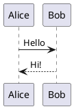

<p align="center">
  
</p>

<p align="center">
  <a href="https://github.com/the-mayankjha/fk_markdown.nvim/releases">
    
  </a>
  <a href="https://github.com/the-mayankjha/fk_markdown.nvim/stargazers">
    
  </a>
  <a href="https://github.com/the-mayankjha/fk_markdown.nvim/blob/main/LICENSE">
    
  </a>
  
  
  <a href="https://luarocks.org/modules/flashcodes-themayankjha/fk_markdown.nvim">
    
  </a>
  <a href="https://github.com/the-mayankjha/fk_markdown.nvim/actions/workflows/release.yml">
    
  </a>
</p>


A lightweight and highly customizable Markdown rendering and live-preview plugin for Neovim.

`fk_markdown.nvim` brings two complementary experiences together:

* **In-editor Markdown Rendering** — transform Markdown syntax into a clean, visually rich editing experience directly inside Neovim.
* **Live Browser Preview** — preview your Markdown documents in a browser with live reload, synchronized scrolling, syntax highlighting, diagrams, math, callouts, and local image support.

The rendering system is designed to be highly configurable, allowing individual Markdown elements to be customized through Lua.


## Features at a Glance

###  Rendering

* Custom heading icons, colors, and backgrounds
* Styled fenced code blocks
* Dynamic language icons and colors
* Custom Markdown tables
* Callouts and blockquotes
* Custom bullets and nested list styling
* Task-list checkboxes
* Context-aware link icons
* WikiLink support
* Thematic breaks
* Treesitter-enhanced rendering
* Per-element configuration
* Custom highlight groups
* Flexible padding and spacing

###  Preview

* Live browser preview
* Automatic live reload
* Synchronized cursor scrolling
* Local image support
* Syntax highlighting
* Custom Highlight.js themes
* Custom syntax-highlighting colors
* LaTeX and Math rendering through KaTeX
* PlantUML diagram rendering
* GitHub-style callouts
* Responsive preview layout
* Configurable browser and server settings
* Custom preview keymaps


#  Installation

## Requirements

* **Neovim 0.9+**
* **Treesitter** — optional, recommended for enhanced syntax highlighting.

## lazy.nvim

```lua
{
  'the-mayankjha/fk_markdown.nvim',
  config = function()
    require('fk_markdown').setup({})
  end,
}
```

## packer.nvim

```lua
use {
  'the-mayankjha/fk_markdown.nvim',
  config = function()
    require('fk_markdown').setup({})
  end,
}
```

## vim-plug

```vim
Plug 'the-mayankjha/fk_markdown.nvim'
```

Then add:

```lua
require('fk_markdown').setup({})
```

## rocks.nvim

```vim
:Rocks install fk_markdown.nvim
```

> [!NOTE]
>  This Plugin is tested for lazy.nvim only 


---

#  Quick Start

`fk_markdown.nvim` works out of the box with a minimal configuration:

```lua
require('fk_markdown').setup({})
```

For most users, this is all that is required to get started.

The rest of this README is divided into two major sections:

* [ Rendering](#-rendering)
* [ Preview](#-preview)


#  Rendering

The rendering system transforms Markdown syntax into a cleaner and more expressive representation directly inside Neovim.

Each Markdown component can be configured independently, allowing you to control icons, colors, borders, padding, backgrounds, and rendering behavior.

The rendering system was initially inspired by and built with reference to the excellent `render-markdown.nvim` project by MeanderingProgrammer. The project provides a strong foundation for in-editor Markdown rendering and demonstrates a highly configurable component-based rendering architecture. [render-markdown.nvim](https://github.com/MeanderingProgrammer/render-markdown.nvim?utm_source=chatgpt.com)

---

## Rendering Features

### Supported Components

| Component           | Features                                              |
| ------------------- | ----------------------------------------------------- |
| **Headings**        | Icons, colors, backgrounds, per-level styling         |
| **Code Blocks**     | Borders, language icons, titles, backgrounds, padding |
| **Tables**          | Borders, presets, padding, alignment indicators       |
| **Callouts**        | Boxed and compact styles, icons, colors               |
| **Blockquotes**     | Accent bars, icons, nested highlight groups           |
| **Bullets**         | Custom icons, nesting-aware rendering, padding        |
| **Checkboxes**      | Custom checked/unchecked icons and states             |
| **Links**           | Context-aware icons, WikiLinks, custom destinations   |
| **Thematic Breaks** | Custom icons, width, and highlighting                 |
| **Images**          | Styled image indicators                               |
| **Inline Elements** | Custom highlighting and rendering behavior            |


#  Headings

Render Markdown headings (`#` through `######`) using custom icons and per-level styling.

<div align="center">
  
  <p><em>Headers with custom icons and per-level foreground colors</em></p>
</div>

### Configuration

```lua
require('fk_markdown').setup({
  heading = {
    enabled = true,
    icon = true,

    icons = {
      '󰲡 ', '󰲣 ', '󰲥 ',
      '󰲧 ', '󰲩 ', '󰲫 ',
    },

    background = {
      enabled = false,

      bg_color = {
        "#1e1e2e", "#1e1e2e", "#1e1e2e",
        "#1e1e2e", "#1e1e2e", "#1e1e2e",
      },

      font_color = {
        "#f38ba8", "#fab387", "#f9e2af",
        "#a6e3a1", "#74c7ec", "#cba6f7",
      },
    },
  },
})
```

### Options

* `enabled` — Enable or disable heading rendering.
* `icon` — Use custom icons instead of native `#` markers.
* `icons` — Icons used for H1 through H6.
* `background.enabled` — Enable or disable heading backgrounds.
* `background.bg_color` — Background colors for H1 through H6.
* `background.font_color` — Foreground colors for H1 through H6.

[Header Configuration](doc/configuration/header.md)

---

#  Code Blocks

Render fenced code blocks with configurable borders, language indicators, titles, backgrounds, and padding.

<div align="center">
  
  <p><em>Code blocks with dynamic language-colored borders and title pills</em></p>
</div>

### Configuration

```lua
require('fk_markdown').setup({
  code = {
    enabled = true,

    -- 'wide' or 'compact'
    style = 'wide',

    background = {
      enabled = false,
      color = "#181825",
    },

    padding = {
      top = 1,
      bottom = 1,
      left = 1,
      right = 2,
    },

    border = {
      enabled = true,
      type = "dynamic",
      color = "#f38ba8",
    },

    title = {
      enabled = true,
      type = "dynamic",
      color = "#a6e3a1",
    },

    icon = {
      enabled = true,
    },
  },
})
```

### Options

* `style` — `'wide'` or `'compact'`.
* `background.enabled` / `background.color` — Configure the block background.
* `padding` — Configure top, bottom, left, and right spacing.
* `border.type` — `"dynamic"` or `"static"`.
* `title.enabled` — Enable or disable language title pills.
* `title.type` — Use dynamic or static title colors.
* `icon.enabled` — Enable or disable language icons.

[Code Block Configuration](doc/configuration/codeblock.md)

---

#  Tables

Render Markdown pipe tables with configurable borders, cell padding, presets, and alignment indicators.

<div align="center">
  
  <p><em>Tables with rounded borders and padded cells</em></p>
</div>

### Configuration

```lua
require('fk_markdown').setup({
  pipe_table = {
    enabled = true,

    -- 'round' | 'double' | 'heavy' | 'none'
    preset = 'none',

    -- 'padded' | 'trimmed' | 'raw' | 'overlay'
    cell = 'padded',

    padding = 1,
    min_width = 0,

    border = {
      '┌', '┬', '┐',
      '├', '┼', '┤',
      '└', '┴', '┘',
      '│', '─',
    },

    border_enabled = true,
    alignment_indicator = '━',

    head = 'RenderMarkdownTableHead',
    row = 'RenderMarkdownTableRow',

    -- 'full' | 'normal' | 'none'
    style = 'full',
  },
})
```

### Options

* `preset` — `'round'`, `'double'`, `'heavy'`, or `'none'`.
* `cell` — `'padded'`, `'trimmed'`, `'raw'`, or `'overlay'`.
* `padding` — Cell spacing.
* `border` — Custom border characters.
* `border_enabled` — Enable or disable table borders.
* `alignment_indicator` — Character used to indicate alignment.
* `style` — `'full'`, `'normal'`, or `'none'`.

[Table Configuration](doc/configuration/table.md)

---

#  Callouts

Render GitHub- and Obsidian-style callouts with custom icons, colors, backgrounds, borders, and layouts.

<div align="center">
  
  <p><em>Boxy callouts with accent bars and rounded borders</em></p>
</div>

### Configuration

```lua
require('fk_markdown').setup({
  quote = {
    enabled = true,

    -- 'boxy' or 'compact'
    style = 'boxy',

    border = true,
    bg = "NONE",
    fg = "#cad3f5",
  },
})
```

### Options

* `style` — `'boxy'` or `'compact'`.
* `border` — Enable or disable the container border.
* `bg` — Background color.
* `fg` — Foreground color.

[Callout Configuration](doc/configuration/callout.md)


#  Blockquotes

Blockquotes can be rendered using a custom accent bar and level-based highlights.

### Configuration

```lua
require('fk_markdown').setup({
  quote = {
    enabled = true,
    icon = '▋',
    repeat_linebreak = false,

    highlight = {
      'RenderMarkdownQuote1',
      'RenderMarkdownQuote2',
      'RenderMarkdownQuote3',
      'RenderMarkdownQuote4',
      'RenderMarkdownQuote5',
      'RenderMarkdownQuote6',
    },
  },
})
```


#  Bullets & Lists

Customize list bullets according to nesting depth.

### Configuration

```lua
require('fk_markdown').setup({
  bullet = {
    enabled = true,

    icons = {
      '●', '○', '◆', '◇',
    },

    left_pad = 0,
    right_pad = 0,

    highlight = 'RenderMarkdownBullet',
  },
})
```

### Options

* `icons` — Bullet characters cycled by nesting depth.
* `left_pad` / `right_pad` — Horizontal spacing.
* `highlight` — Highlight group for bullet icons.

---

#  Checkboxes

Replace Markdown task-list markers with custom icons and highlight groups.

### Configuration

```lua
require('fk_markdown').setup({
  checkbox = {
    enabled = true,

    unchecked = {
      icon = '󰄱 ',
      highlight = 'RenderMarkdownUnchecked',
    },

    checked = {
      icon = '󰱒 ',
      highlight = 'RenderMarkdownChecked',
    },

    custom = {
      todo = {
        raw = '[-]',
        rendered = '󰥔 ',
        highlight = 'RenderMarkdownTodo',
      },
    },
  },
})
```


#  Links

Render links with contextual icons based on their destination.

Supports:

* Images
* Email links
* Standard hyperlinks
* WikiLinks
* GitHub
* YouTube
* Custom URL patterns

### Configuration

```lua
require('fk_markdown').setup({
  link = {
    enabled = true,

    image = '󰥶 ',
    email = '󰀓 ',
    hyperlink = '󰌹 ',

    highlight = 'RenderMarkdownLink',

    wiki = {
      enabled = true,
      icon = '󱗖 ',
    },

    custom = {
      web = {
        icon = '󰖟 ',
        pattern = '^http',
      },

      github = {
        icon = '󰊤 ',
        pattern = 'github%.com',
        kind = 'url',
      },

      youtube = {
        icon = '󰗃 ',
        pattern = 'youtube[^.]*%.com',
        kind = 'url',
      },
    },
  },
})
```

# ━ Thematic Breaks

Customize horizontal rules and Markdown thematic breaks.

```lua
require('fk_markdown').setup({
  dash = {
    enabled = true,
    icon = '─',
    width = 'full',
    highlight = 'RenderMarkdownDash',
  },
})
```

---

#  Complete Rendering Configuration

A complete example combining the major rendering components:

```lua
require('fk_markdown').setup({

  -- ── Headings ──────────────────────────────────────────────
  heading = {
    enabled = true,
    icon = true,

    icons = {
      '󰲡 ', '󰲣 ', '󰲥 ',
      '󰲧 ', '󰲩 ', '󰲫 ',
    },

    background = {
      enabled = false,

      bg_color = {
        "#1e1e2e", "#1e1e2e", "#1e1e2e",
        "#1e1e2e", "#1e1e2e", "#1e1e2e",
      },

      font_color = {
        "#f38ba8", "#fab387", "#f9e2af",
        "#a6e3a1", "#74c7ec", "#cba6f7",
      },
    },
  },

  -- ── Code Blocks ───────────────────────────────────────────
  code = {
    enabled = true,
    style = 'wide',

    background = {
      enabled = false,
      color = "#181825",
    },

    padding = {
      top = 1,
      bottom = 1,
      left = 1,
      right = 2,
    },

    border = {
      enabled = true,
      type = "dynamic",
      color = "#f38ba8",
    },

    title = {
      enabled = true,
      type = "dynamic",
      color = "#a6e3a1",
    },

    icon = {
      enabled = true,
    },
  },

  -- ── Callouts ──────────────────────────────────────────────
  quote = {
    enabled = true,
    style = 'boxy',
    border = true,
    bg = "NONE",
    fg = "#cad3f5",
  },

  -- ── Bullets ───────────────────────────────────────────────
  bullet = {
    enabled = true,
    icons = { '●', '○', '◆', '◇' },
  },

  -- ── Checkboxes ────────────────────────────────────────────
  checkbox = {
    enabled = true,

    unchecked = {
      icon = '󰄱 ',
      highlight = 'RenderMarkdownUnchecked',
    },

    checked = {
      icon = '󰱒 ',
      highlight = 'RenderMarkdownChecked',
    },
  },

  -- ── Tables ────────────────────────────────────────────────
  pipe_table = {
    enabled = true,
    preset = 'none',
    style = 'full',
  },

  -- ── Links ─────────────────────────────────────────────────
  link = {
    enabled = true,
    image = '󰥶 ',
    hyperlink = '󰌹 ',
  },

  -- ── Thematic Breaks ───────────────────────────────────────
  dash = {
    enabled = true,
    icon = '─',
  },

  -- ── Signs ─────────────────────────────────────────────────
  sign = {
    enabled = true,
  },

  -- ── Indentation ───────────────────────────────────────────
  indent = {
    enabled = false,
  },
})
```

---

#  Rendering Documentation

Detailed configuration documentation:

* [Header Configuration](doc/configuration/header.md)
* [Code Block Configuration](doc/configuration/codeblock.md)
* [Table Configuration](doc/configuration/table.md)
* [Callout Configuration](doc/configuration/callout.md)
* [PlantUML Configuration](doc/configuration/plantuml.md)
* [General Configuration](doc/configuration.md)
* [Custom Handlers](doc/custom-handlers.md)
* [Limitations](doc/limitations.md)
* [Troubleshooting](doc/troubleshooting.md)


# Preview

The **Preview** system is a separate part of `fk_markdown.nvim`.

Instead of rendering Markdown inside Neovim, Preview runs a lightweight local web server and opens the current Markdown document in your browser.

Changes made in Neovim are automatically synchronized with the browser.

---

## Preview Features

### Live Reload

Changes to the Markdown document are automatically pushed to the browser without manually refreshing the page.

### Synchronized Scrolling

The browser can follow the current cursor position in Neovim.

Moving through the document in Neovim automatically updates the browser's scroll position.

###  Browser Preview

Open a rendered Markdown document in your preferred browser directly from Neovim.

###  Local Images

Local images are resolved relative to the Markdown document and served through the preview server.

###  Syntax Highlighting

Code blocks are rendered using Highlight.js with support for predefined themes and custom color overrides.

###  LaTeX & Math

Preview supports:

* Inline math using `$...$`
* Display math using `$$...$$`
* `math` fenced code blocks
* `latex` fenced code blocks

Math rendering is provided through KaTeX.

###  PlantUML

PlantUML code blocks can be rendered as responsive SVG/PNG diagrams.

Example:

````markdown

````

###  GitHub Callouts

The preview renderer supports GitHub-style alerts:

> [!NOTE]
> This is a note.

> [!TIP]
> This is a tip.

> [!IMPORTANT]
> This is important.

> [!WARNING]
> This is a warning.

> [!CAUTION]
> This is a caution.


###  Responsive Images

Images are rendered responsively inside the browser preview.

###  Server-Sent Events

The preview server uses Server-Sent Events to push document updates to the browser.

###  Lightweight Server

The preview server uses Neovim's built-in networking capabilities through `vim.uv` / `vim.loop`, avoiding the need for an external web server.

---

#  Preview Commands

| Command                                  | Description                                       |
| ---------------------------------------- | ------------------------------------------------- |
| `:FkPreview`                             | Start the preview server and open the browser     |
| `:FkPreviewStop`                         | Stop the preview server                           |
| `:FkPreviewToggle`                       | Toggle the preview server                         |
| `:FkPreviewAutoScroll [on\|off\|toggle]` | Enable, disable, or toggle synchronized scrolling |


#  Preview Configuration

```lua
require('fk_markdown').setup({
  preview = {
    enabled = true,

    -- Automatically start preview
    auto_start = false,

    -- Automatically stop preview when the buffer closes
    auto_close = true,

    -- Synchronize browser scrolling with the Neovim cursor
    auto_scroll = true,

    -- Browser executable.
    -- Empty string uses the system default.
    browser = "",

    -- Address used by the preview server
    open_ip = "127.0.0.1",

    -- nil = automatically select a random available port
    port = nil,

    -- "dark" or "light"
    theme = "dark",

    -- ── Syntax Highlighting ────────────────────────────────
    syntax_highlight = {
      enabled = true,

      -- Highlight.js theme
      theme = "github-dark",

      -- Available examples:
      -- "atom-one-dark"
      -- "monokai"
      -- "tokyo-night-dark"
      -- "dracula"

      colors = {
        background = "#181825",
        keyword = "#cba6f7",
        string = "#a6e3a1",
        comment = "#6c7086",
        function_name = "#89b4fa",
      },
    },

    -- ── Keymaps ────────────────────────────────────────────
    keymap = {
      start = "<leader>mp",
      stop = "<leader>ms",
      toggle = "<leader>mt",
    },
  },
})
```


#  Preview Architecture

The preview system follows a simple workflow:

```text
┌────────────────────┐
│   Markdown Buffer  │
│      Neovim        │
└─────────┬──────────┘
          │
          │ File Changes
          ▼
┌────────────────────┐
│  Local HTTP Server │
│    vim.uv / loop    │
└─────────┬──────────┘
          │
          │ SSE / HTTP
          ▼
┌────────────────────┐
│   Browser Preview  │
│                    │
│  Markdown → HTML   │
│  Highlight.js      │
│  KaTeX             │
│  PlantUML          │
└────────────────────┘
```

This keeps the preview system local and lightweight while providing a much richer viewing experience than terminal-only rendering.


#  Preview Themes

The preview supports both light and dark themes:

```lua
preview = {
  theme = "dark",
}
```

Syntax highlighting can independently be configured using Highlight.js themes:

```lua
syntax_highlight = {
  enabled = true,
  theme = "github-dark",
}
```

Custom colors can be supplied when additional control is required:

```lua
syntax_highlight = {
  colors = {
    background = "#181825",
    keyword = "#cba6f7",
    string = "#a6e3a1",
    comment = "#6c7086",
    function_name = "#89b4fa",
  },
}
```


#  Preview Documentation

For detailed preview configuration, see:

* [Web Preview Configuration](doc/configuration/preview.md)
* [PlantUML Configuration](doc/configuration/plantuml.md)


#  Rendering vs Preview

`fk_markdown.nvim` intentionally separates the two systems:

|                         | Rendering                 | Preview                  |
| ----------------------- | ------------------------- | ------------------------ |
| **Environment**         | Neovim                    | Web browser              |
| **Purpose**             | Better editing experience | Final document preview   |
| **Rendering**           | Virtual text / extmarks   | HTML                     |
| **Live Updates**        | Immediate                 | Live reload              |
| **Scrolling**           | Native editor             | Synchronized with cursor |
| **Syntax Highlighting** | Neovim                    | Highlight.js             |
| **Math**                | Editor rendering          | KaTeX                    |
| **PlantUML**            | Editor support            | SVG/PNG diagrams         |
| **Images**              | Editor rendering          | Local image serving      |
| **Callouts**            | Neovim rendering          | HTML/CSS rendering       |

The two systems complement each other rather than replacing one another.

---

#  Acknowledgements

`fk_markdown.nvim` would not exist without the work and ideas shared by the Neovim community.

### [`render-markdown.nvim`](https://github.com/MeanderingProgrammer/render-markdown.nvim)

Special thanks to **MeanderingProgrammer** for `render-markdown.nvim`.

The initial idea for `fk_markdown.nvim`, as well as the foundation and general approach to in-editor Markdown rendering, was heavily inspired by and developed with reference to `render-markdown.nvim`.

Its component-based rendering architecture and approach to making Markdown more pleasant to read inside Neovim provided an important starting point for this project.

This project is independently developed and extends that idea with additional customization and a separate browser-based Preview system.

### Other Projects

Thanks to the developers and maintainers of the many open-source projects that make this plugin possible and provide valuable references, inspiration, tooling, and integrations.

In particular:

* **Neovim** — The editor and runtime that makes this plugin possible.
* **Tree-sitter** — Structural parsing and syntax information used by the rendering system.
* **nvim-web-devicons** — Language and file-type icons.
* **Highlight.js** — Syntax highlighting for browser preview.
* **KaTeX** — Mathematical expression rendering.
* **PlantUML** — Diagram rendering.
* **GitHub Markdown** — Callout/alert conventions used by the preview renderer.
* **headlines.nvim** — An important source of inspiration for Markdown presentation in Neovim.
* **Other Neovim plugins and their authors** — For ideas, implementation references, and continued inspiration throughout development.

We are grateful to the maintainers and contributors of these projects and to the broader Neovim ecosystem.


#  Contributing

Contributions are welcome!

Before submitting a significant change:

1. **Discuss new features** — Open an issue to discuss the proposed functionality.
2. **Keep documentation updated** — Update relevant documentation when behavior or configuration changes.
3. **Test your changes** — Test across different terminal emulators and color schemes.


# 📄 License

`fk_markdown.nvim` is licensed under the **MIT License**.

See [LICENSE](LICENSE) for the complete license text.

#  Community

Built for the Neovim community.

If you find `fk_markdown.nvim` useful:

*  Star the repository
*   Report issues
*  Suggest improvements
*  Contribute code or documentation
*  Share your configurations and screenshots

Thank you to everyone who uses, contributes to, and helps improve the project.
